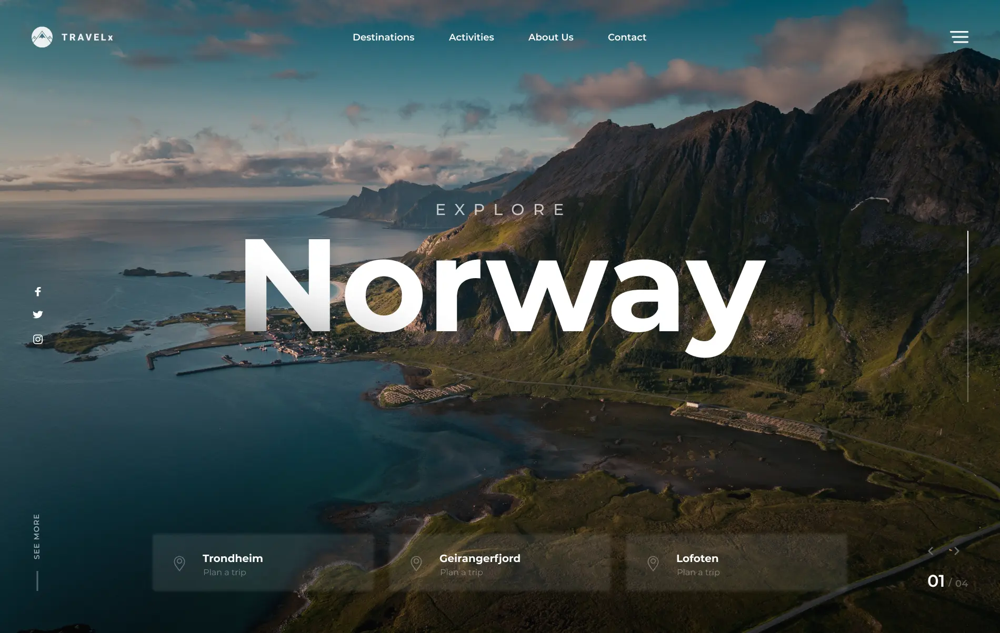

# React - Travel X

[Показать проект](https://tim2015web.github.io/react_travel_x/)

[Макет Figma](https://www.figma.com/file/CSZzjKraySkNCE9J7r7GWN/Travel-X---Swiper-Header?type=design&node-id=0-1&mode=design&t=U8olGesbWkPBsLpB-0)

---

